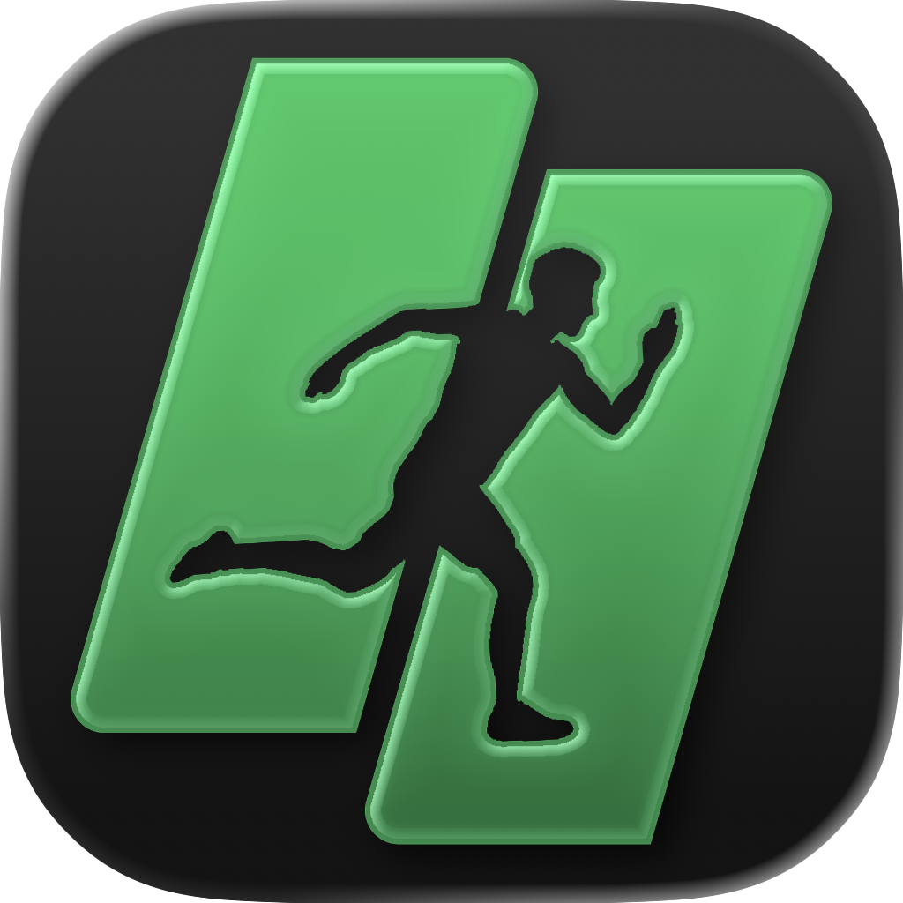
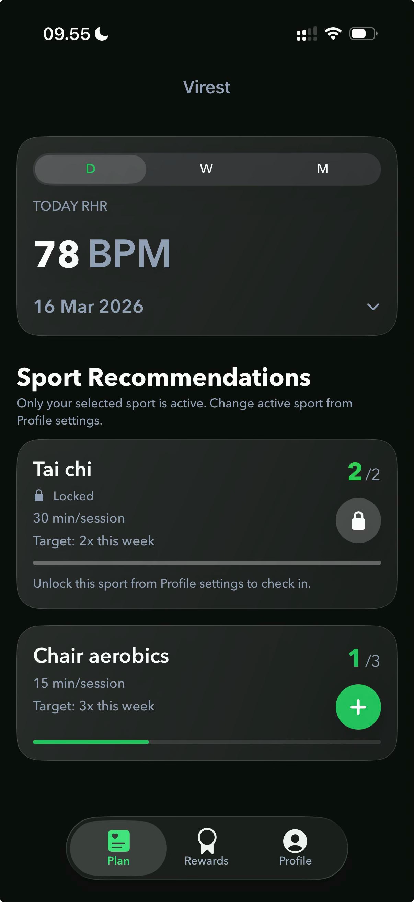

# ViRest

ViRest is an application that helps young adults who are unsure which sports are suitable for them choose appropriate activities based on their personal conditions. The app turns user inputs such as physical conditions, sport preferences, and environmental factors into personalized sports recommendations aimed at safely improving cardiovascular fitness and maintaining a healthy resting heart rate.

## 🧠 Background

Many young adults have elevated resting heart rates due to sedentary lifestyles but lack guidance on how to improve their cardiovascular health through appropriate exercise. Most existing fitness applications focus on general fitness goals and provide generic workout plans rather than specifically targeting improvements in resting heart rate or cardiovascular efficiency.

ViRest addresses this problem by recommending personalized sports and exercises based on the user's health condition, environment, and sport preferences. These recommendations are designed to help users safely lower or maintain a healthy resting heart rate while improving their overall cardiovascular fitness.

## ✨ Features / Key Features

### 🏃 Personalized Sports Recommendation
Generate personalized sports recommendations based on the user's health condition, environmental factors, and sport preferences to safely work toward a healthy resting heart rate target.

### ❤️ Apple Health Integration
Integrate with Apple Health to access relevant health information and support recommendations based on the user's physical condition.

### ✅ Workout Check-In & Feedback
Allow users to check in after completing workouts and provide feedback about their exercise experience.

## 🛠 Tech Stack
- Swift
- SwiftUI
- SwiftData
- HealthKit
- Firebase Authentication
- Cloud Firestore

## 📷 Screenshots

    
    

## 👥 Team Members
- Desy
- Dinda
- Dody
- Fajar
- Joshua
- Tomo